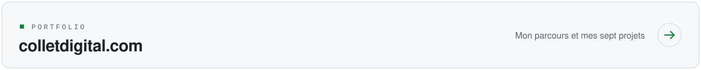
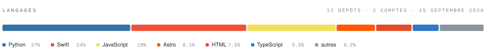
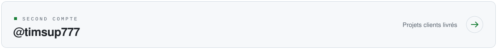

<picture>
  <source media="(prefers-color-scheme: dark)" srcset="assets/header-dark.svg">
  
</picture>

Étudiant en BTS SIO SLAM à Montreuil, après une reconversion depuis le BTP. Je développe
des applications iOS natives en Swift, et je vise un bachelor en cybersécurité pour aller
vers le pentest.

<a href="https://www.colletdigital.com">
  <picture>
    <source media="(prefers-color-scheme: dark)" srcset="assets/bouton-portfolio-dark.svg">
    
  </picture>
</a>

## Projets

### Zéro Trace — *en développement*

Jeu vidéo cyberpunk sur la cybersécurité et l'anonymat numérique : hacking, infiltration,
protection des données. Le terrain vers lequel je veux aller, rendu jouable.

`Next.js` · code privé

### [Mon Mental](https://github.com/timsup777/-mon-mentale) — *en cours*

Application iOS qui met en relation psychologues et patients, avec appels audio et vidéo.
Client Swift, backend Node et Firestore.

`Swift` `SwiftUI` `Node` `Firestore`

### [Trouvaille](https://trouvaille.colletdigital.com) — *en cours*

Application de rencontres et de sorties, en lancement coordonné iOS et Android, avec son
site. La partie web est [en ligne](https://trouvaille.colletdigital.com).

`Swift` `React` `Node`

### [Crash Radar AI](https://github.com/timsup-bit/DASH-CRASH)

Tableau de bord qui surveille les marchés et publie un score de risque de crash sur 100.
Six familles de signaux agrégées — actions, crédit, volatilité, liquidité, macro, sentiment —
avec un backtester et un moteur de news intégrés.

`Python` `FastAPI` `scikit-learn` `Docker`

### Bot Polymarket

Bot automatisé sur la plateforme de marchés de prédiction Polymarket : analyse des cotes
et exécution de stratégies.

`Python` · code privé

**Aussi** — [Affûteur à Vélo](https://github.com/timsup777/AFT)
([en ligne](https://aft-opal.vercel.app)), un site livré pour un artisan affûteur ·
[CFP](https://github.com/timsup-bit/CFP-GROUPE), une application immobilière en monorepo
TypeScript · [Bénévolat](https://github.com/timsup-bit/BNV)
([démo](https://bnv-ten.vercel.app)), en Vue 3.

## Stack

**Mobile** — Swift · SwiftUI · UIKit · Xcode 
**Web & back** — TypeScript · Python · Java · PHP · Node · Fastify · FastAPI 
**Front** — Vue 3 · Astro · Vite · Tailwind 
**Données & outils** — SQL · PostgreSQL · Docker · Git · GitHub Actions

## Répartition du code

<picture>
  <source media="(prefers-color-scheme: dark)" srcset="assets/langages-dark.svg">
  
</picture>

## Ailleurs

Le code de Mon Mental, de Trouvaille et de mes sites clients vit sur mon second compte.

<a href="https://github.com/timsup777">
  <picture>
    <source media="(prefers-color-scheme: dark)" srcset="assets/bouton-vers-timsup777-dark.svg">
    
  </picture>
</a>

## Contact

[Portfolio](https://www.colletdigital.com) · [LinkedIn](https://www.linkedin.com/in/timoth%C3%A9e-collet-457b96238)

Disponible pour des projets — je facture en micro-entreprise.

---

Le bandeau et le panneau des langages sont deux SVG maison, en version claire et sombre.
Le panneau est recalculé chaque nuit depuis l'API GitHub par
<a href="scripts/langages.ps1">mon propre script</a>, via une GitHub Action — pas de service tiers.
Il agrège mes deux comptes, dépôts vides et brouillons issus de templates exclus.
